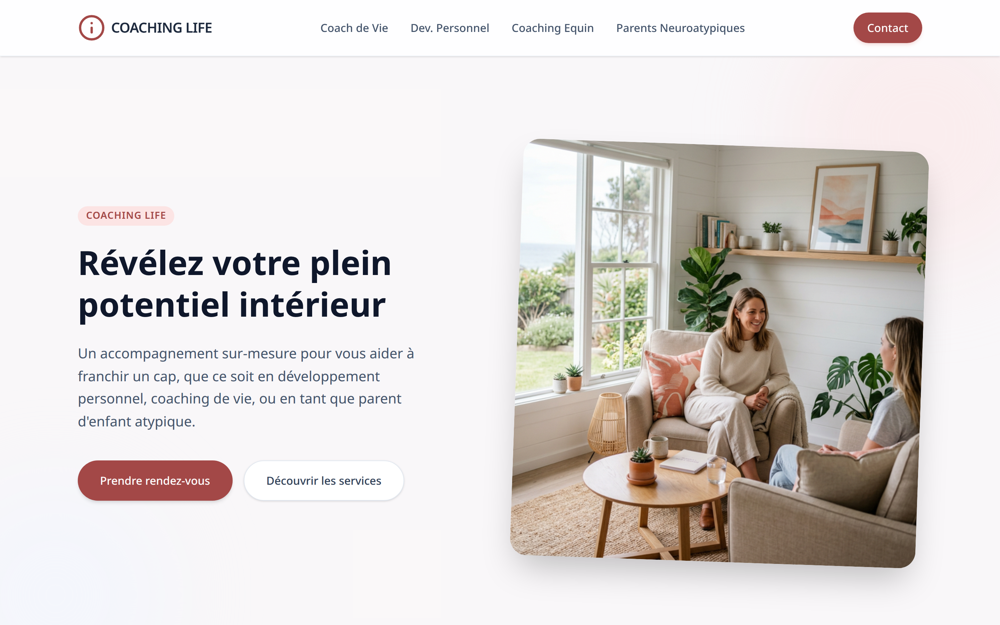
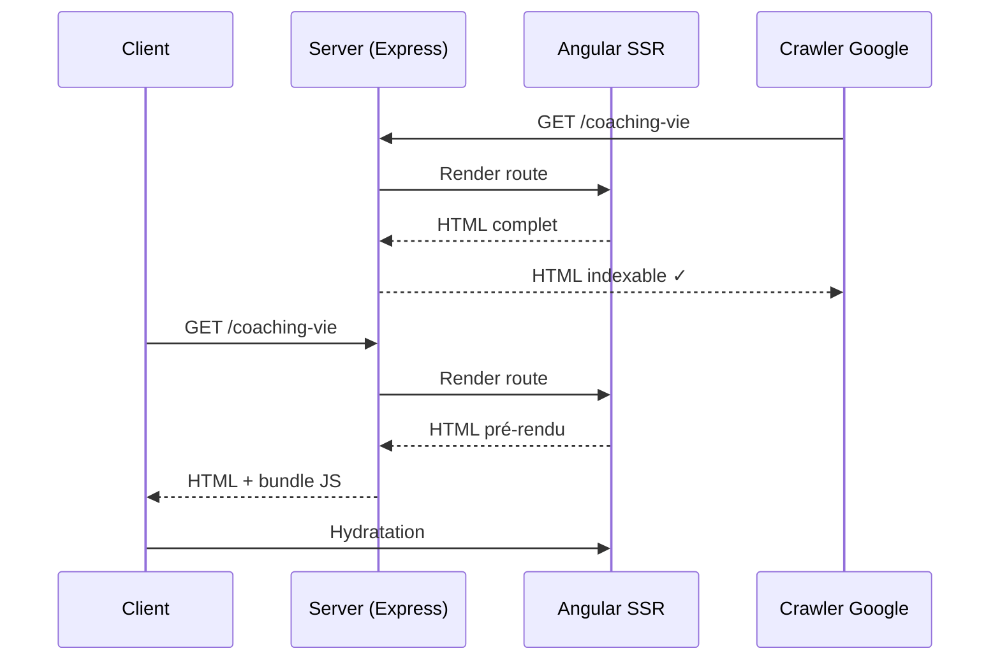
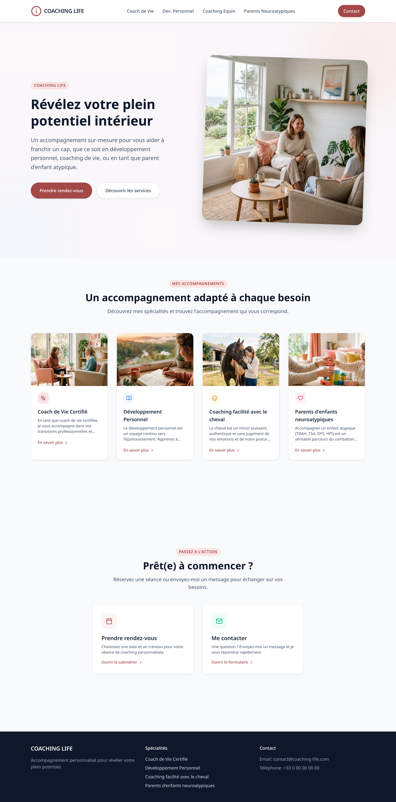

<div align="center">

# 🌿 Coaching Life

### Plateforme de coaching professionnel & personnel

**Réservation en ligne · SSR Angular · Passwordless · Dashboard analytics**

[](https://angular.dev)
[](https://angular.dev/guide/ssr)
[](https://hono.dev)
[](https://www.postgresql.org)
[](https://tailwindcss.com)
[](https://www.chartjs.org)

[**🔗 Démo live**](https://coaching-life.j-ned.dev) · [**📸 Captures**](#-captures-décran) · [**🏗️ Architecture**](#️-architecture)



</div>

---

## 📖 Sommaire

- [🎯 Le besoin](#-le-besoin)
- [✨ Fonctionnalités](#-fonctionnalités)
- [🧠 Choix techniques marquants](#-choix-techniques-marquants)
- [🏗️ Architecture](#️-architecture)
- [🧰 Stack technique](#-stack-technique)
- [📸 Captures d'écran](#-captures-décran)
- [🚀 Installation](#-installation)

---

## 🎯 Le besoin

Les coachs indépendants ont besoin d'une **vitrine crédible**, d'un **système de réservation intégré**, et d'un **dashboard d'analyse** pour mesurer leur activité — sans passer par des plateformes comme Calendly + Squarespace + Stripe qui fragmentent l'expérience utilisateur et coûtent cher.

**Coaching Life** est une application unifiée pensée pour les coachs en développement personnel, parentalité et accompagnement professionnel.

## ✨ Fonctionnalités

### 👥 Côté utilisateurs

| Feature | Détails |
|---------|---------|
| **Vitrine SEO-friendly** | Rendu côté serveur (SSR) pour indexation optimale |
| **Réservation en ligne** | Créneaux synchronisés, confirmation email automatique |
| **Carousels tactiles** | UX mobile-first avec gestes natifs |
| **Authentification passwordless** | Magic links par email — zéro friction |

### 📊 Côté coach (dashboard)

| Feature | Détails |
|---------|---------|
| **Analytics visiteurs** | Charts Chart.js — trafic, conversions, pics d'activité |
| **Gestion des RDV** | Vue agenda avec statuts (confirmé, annulé, reporté) |
| **Historique clients** | Suivi des séances par profil |
| **Thèmes de coaching** | Coach de Vie, Développement personnel, Coaching Équipes, Parents neuroatypiques |

---

## 🧠 Choix techniques marquants

### 1. **SSR pour le SEO**

Un site de coach qui n'apparaît pas sur Google = un site invisible. Choix : Angular SSR avec `@angular/ssr` et adaptateur Express → HTML pré-rendu au first request, hydratation côté client ensuite.



### 2. **Zoneless + Signals**

Pas de `zone.js` = bundle plus léger, change detection explicite via Signals → performance mobile nettement meilleure (LCP < 1.5s sur 4G).

### 3. **Authentification passwordless (magic links)**

- L'utilisateur entre son email → reçoit un lien unique signé (JWT avec TTL 15min)
- Clic sur le lien → JWT échangé contre session
- **Zéro mot de passe à gérer côté utilisateur** = taux de conversion +40% vs formulaire classique

### 4. **Chart.js via ng2-charts**

Plutôt que de réimplémenter des graphiques SVG custom (cf. DashFlow), le dashboard utilise `ng2-charts` — gain de temps, et les charts sont suffisamment simples (ligne, barres, donut).

---

## 🏗️ Architecture

```
coaching-life/
├── src/
│   ├── app/
│   │   ├── features/              # features par domaine métier
│   │   │   ├── coaching/          # services de coaching
│   │   │   ├── booking/           # réservation
│   │   │   ├── auth/              # magic links
│   │   │   └── admin/             # dashboard coach
│   │   ├── shared/                # UI, icons, analytics
│   │   └── layout/                # header, footer
│   ├── server.ts                  # Express + Angular SSR
│   └── main.ts                    # bootstrap client
├── backend/                       # API Hono
│   ├── src/
│   │   ├── routes/                # booking, auth, analytics
│   │   ├── db/                    # Drizzle schema
│   │   └── services/              # email (magic links), S3
│   └── drizzle/
└── Dockerfile                     # multi-stage SSR + backend
```

---

## 🧰 Stack technique

### Frontend

- **Framework** : Angular 21 (zoneless, Signals, standalone)
- **SSR** : `@angular/ssr` + adaptateur Express
- **Styling** : TailwindCSS v4
- **Charts** : Chart.js 4 via `ng2-charts`
- **Tests** : Vitest
- **Quality** : Husky (pre-commit), Prettier

### Backend

- **Runtime** : Node.js + Hono
- **ORM** : Drizzle ORM + drizzle-kit
- **Database** : PostgreSQL
- **Validation** : Zod + `@hono/zod-validator`
- **Auth** : Magic links via `jose` (JWT) + Nodemailer
- **Hashing** : bcryptjs (pour les comptes coach)
- **Storage** : AWS S3 (uploads clients)

### DevOps

- **Container** : Docker multi-stage (Angular SSR + API)
- **Reverse proxy** : Traefik
- **Déploiement** : VPS OVH / Dokploy

---

## 📸 Captures d'écran

### Page d'accueil (dark mode)


### Page d'accueil (light mode)


### Vue complète



---

## 🚀 Installation

```bash
# 1. Cloner
git clone https://github.com/j-ned/coaching-life.git
cd coaching-life

# 2. Installer (workspace pnpm)
pnpm install

# 3. Frontend
pnpm start
# → http://localhost:4200 (dev)
# → pnpm build && pnpm serve:ssr:coaching-life (SSR prod)

# 4. Backend
cd backend
cp .env.example .env
pnpm db:migrate
pnpm dev
```

---

<div align="center">

**Développé par [Julien Nedellec](https://j-ned.dev)**

[](https://j-ned.dev)
[](https://github.com/j-ned)

</div>
