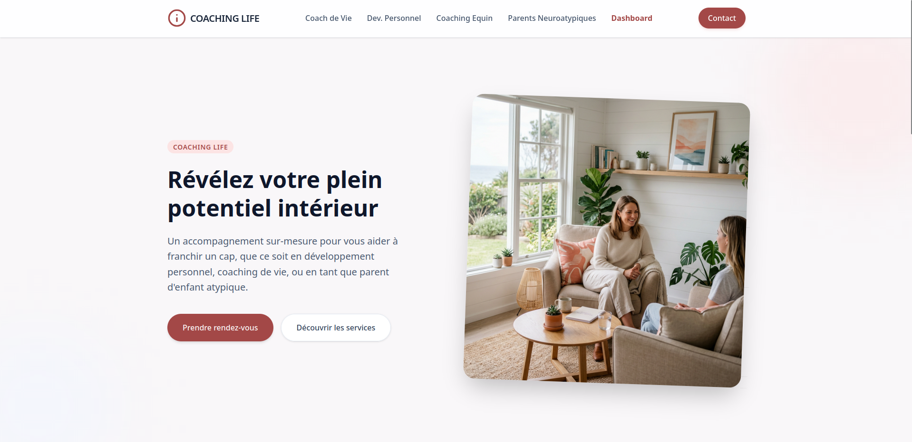

# Coaching Life



*(English version available [below](#english-version))*

Bienvenue sur **Coaching Life** ! Ce projet est une Single Page Application (SPA) moderne et réactive conçue pour vous accompagner dans votre développement personnel et professionnel.

## 🚀 Fonctionnalités Clés

*   **Architecture Moderne** : Construit avec Angular 21, principes de clean architecture et fonctionnalités Angular modernes (zoneless, signals).
*   **Authentification** : Connexion sans mot de passe utilisant Supabase Magic Link.
*   **Interface Réactive** : Design entièrement réactif basé sur Tailwind CSS 4, incluant des carrousels horizontaux adaptés aux mobiles.
*   **Visualisation de Données** : Graphiques interactifs propulsés par Chart.js.
*   **Rendu Côté Serveur (SSR)** : Pages optimisées pour le SEO avec Angular SSR.

## 🛠️ Stack Technique

*   **Frontend** : Angular 21.2.0, TypeScript
*   **Style** : Tailwind CSS 4, PostCSS
*   **Backend & DB** : Supabase (PostgreSQL, Auth, SSR)
*   **Graphiques** : Chart.js / ng2-charts
*   **Tests** : Vitest (Tests Unitaires) & JSDOM
*   **Gestionnaire de Paquets** : pnpm 10
*   **Formatage** : Prettier & Husky

## 📦 Démarrage Rapide

### Prérequis

Assurez-vous d'avoir `pnpm` installé et configuré sur votre système.

### Installation

1. Clonez le dépôt et installez les dépendances :
```bash
pnpm install
```

2. Configurez vos variables d'environnement Supabase dans `src/environments/environment.ts` et `src/environments/environment.development.ts`.

### Serveur de Développement

Lancez le serveur de développement local :
```bash
pnpm start
```
Naviguez vers `http://localhost:4200/`. L'application se rechargera automatiquement si vous modifiez l'un des fichiers sources.

## 🏗️ Build

Exécutez la commande suivante pour compiler le projet :
```bash
pnpm build
```
Les fichiers compilés seront stockés dans le répertoire `dist/`.

## 🧪 Tests et Formatage

Pour lancer les tests unitaires avec Vitest :
```bash
pnpm test
```

Pour formater et vérifier votre code :
```bash
pnpm format
pnpm format:check
```

---

<br>

<a name="english-version"></a>
# English Version

Welcome to **Coaching Life**! This project is a modern, responsive Single Page Application (SPA) designed to support your personal and professional development.

## 🚀 Key Features

*   **Modern Architecture**: Built with Angular 21, clean architecture principles, and modern Angular features (zoneless, signals).
*   **Authentication**: Passwordless login using Supabase Magic Link.
*   **Responsive UI**: Fully responsive design leveraging Tailwind CSS 4, including mobile-adapted horizontal carousels.
*   **Data Visualization**: Interactive charts powered by Chart.js.
*   **Server-Side Rendering:** SEO-friendly pages with Angular SSR.

## 🛠️ Tech Stack

*   **Frontend**: Angular 21.2.0, TypeScript
*   **Styling**: Tailwind CSS 4, PostCSS
*   **Backend & DB**: Supabase (PostgreSQL, Auth, SSR)
*   **Charts**: Chart.js / ng2-charts
*   **Testing**: Vitest (Unit Tests) & JSDOM
*   **Package Manager**: pnpm 10
*   **Formatting**: Prettier & Husky

## 📦 Getting Started

### Prerequisites

Make sure you have `pnpm` installed and configured on your system.

### Installation

1. Clone the repository and install the dependencies:
```bash
pnpm install
```

2. Set up your Supabase environment variables in `src/environments/environment.ts` and `src/environments/environment.development.ts`.

### Development Server

Run the local development server:
```bash
pnpm start
```
Navigate to `http://localhost:4200/`. The application will automatically reload if you change any of the source files.

## 🏗️ Build

Run the following command to build the project:
```bash
pnpm build
```
The build artifacts will be stored in the `dist/` directory.

## 🧪 Testing and Formatting

To run the unit tests leveraging Vitest:
```bash
pnpm test
```

To format and check your code:
```bash
pnpm format
pnpm format:check
```

---
*Créé avec ❤️ pour un meilleur accompagnement. / Created with ❤️ for better coaching and development.*
